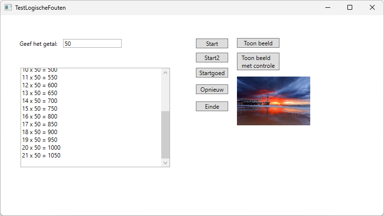

# Oefening 1: TestLogischeFouten

In dit voorbeeld wordt getoond hoe logische fouten met debugging
gemakkelijker gevonden kunnen worden. Er wordt eveneens getoond hoe
"onverwachte" fouten opgevangen kunnen worden.

Maak de toepassing TestFoutenTryCatch dat hiervoor gebruikt kan worden.

Het venster bevat:

\- De tekstvakken *numberTextBox* en *resultTextBox*. Het is de
bedoeling dat in het tekstvak *resultTextBox* de
vermenigvuldigingstafels getoond worden van het ingegeven getal
(*numberTextBox*). De tafels worden getoond tot het product minstens
1000 is of tot er 50 regels getoond zijn.

\- De opdrachtknop *startButton***.** Bij het klikken op deze knop wordt
volgende code uitgevoerd. Controleer met debugging wat fout gaat indien
je een decimaal getal ingeeft en het tekstvak leeg laat.

> private void startButton_Click(object sender, EventArgs e)
>
> {
>
> int product = 0;

int counter = 1;

> int number = 0;
>
> resultTextBox.Text = \"\";
>
> number = Convert.ToInt32(numberTextBox.Text);
>
> while (product \<= 1000 \|\| counter \<= 51)
>
> {
>
> product = number \* counter;
>
> resultTextBox.Text += \$\"{counter} x {number} = {product}\\n\";

counter++;

> }
>
> }

-   De opdrachtknop *btnStart2*. Bij het klikken op deze knop wordt
    volgende code uitgevoerd. Controleer met debugging wat fout gaat:

> private void start2Button_Click(object sender, EventArgs e)
>
> {
>
> int product = 0;

int counter = 1;

> int number = 0;
>
> resultTextBox.Text = \"\";
>
> number = Convert.ToInt32(numberTextBox.Text);
>
> while (product \<= 1000 && counter \<= 51)
>
> {
>
> resultTextBox.Text = resultTextBox.Text + counter.ToString() + \" x \"
> +
>
> number.ToString() + \" = \" + product.ToString() + \"\\r\\n\";
>
> counter ++;
>
> }
>
> }

\- De opdrachtknop *startCorrectButton***.** Schrijf nu zelf de code
waarbij het programma perfect werkt.

\- De opdrachtknoppen *clearButton* en *closeButton*.

\- Een image *showImage* om een afbeelding te kunnen tonen.

\- De opdrachtknop *ShowImageButton***.** Bij het klikken op deze knop
wordt een willekeurige waarde van 0 tot 9 bepaald en afhankelijk van die
waarde wordt de afbeelding "zee0.jpg", "zee1.jpg", ..."zee9.jpg" uit een
vooraf bepaalde map getoond.

\- De opdrachtknop *ShowImageWithCheckButton***.** Bij het klikken op
deze knop gebeurt hetzelfde, maar indien een bepaald beeld niet zou
voorkomen in de vooraf bepaalde map, dan wordt een foutmelding
("Afbeelding ... niet aanwezig.") gegeven.

Schermvoorbeeld drukken knop *startButton*. Probleem is dat er teveel
regels worden getoond, code stopt niet bij getal 1000.

Schermvoorbeeld drukken knop btnStart2. Hierin is het probleem opgelost,
maar de code test niet op alle fouten.

